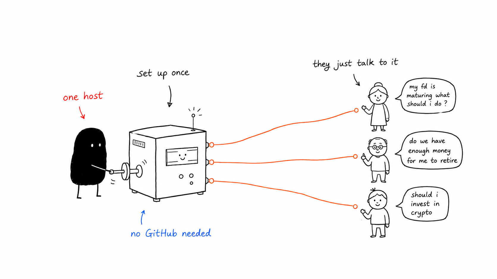
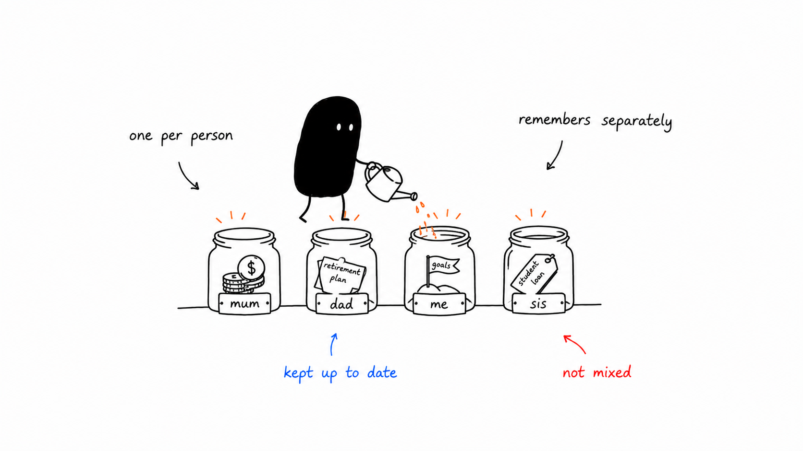
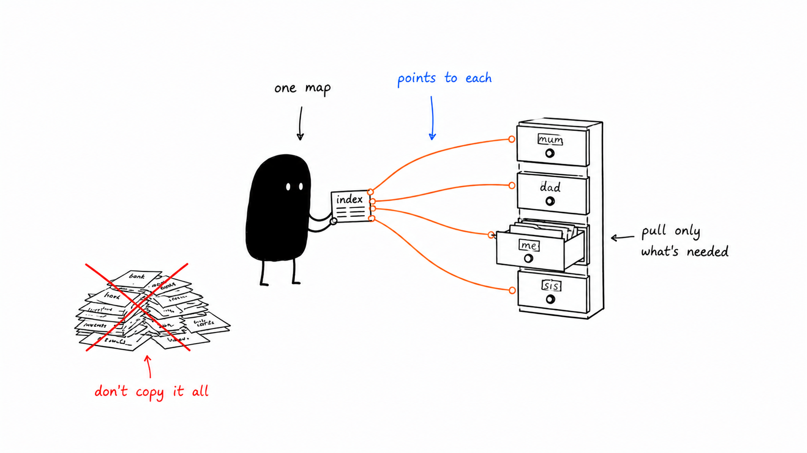

<div align="center">

<pre>
  _____                   _____ _______ _    _ _____
 / ____|  /\        /\   |  __ \__   __| |  | |_   _|
| (___   /  \      /  \  | |__) | | |  | |__| | | |
 \___ \ / /\ \    / /\ \ |  _  /  | |  |  __  | | |
 ____) / ____ \  / ____ \| | \ \  | |  | |  | |_| |_
|_____/_/    \_\/_/    \_\_|  \_\ |_|  |_|  |_|_____|
</pre>

### Rich families always have a money guy. What if yours did too?

Someone who knows your whole family and their money inside out. That is Saarthi, and it runs on your own machine.

`local-first` · `markdown memory` · `per-member` · `teaches, never sells` · `no cloud, no database`


[See it in action](#see-it-in-action) · [How it works](#how-it-works-under-the-hood) · [What works today](#what-works-today) · [Roadmap](#roadmap) · [Run it](#run-it)

</div>

---

A money guy is the quiet advantage wealthy families have always had: one trusted person who knows every member, remembers every decision, and tells you the tradeoff instead of selling you a product. Saarthi is that person for everyone else.

Most money tools assume one person and one account. Real family decisions are not like that. Ask *"should I prepay the home loan or invest the surplus?"* and the honest answer depends on your parents' retirement runway, your sibling's education timeline, and your own job stability, not just your balance sheet.

Saarthi knows every family member as a distinct person, explains its reasoning so you understand each decision yourself, and is built to make you more financially literate. You talk to it like a family friend who happens to be a great advisor, and every conversation makes it understand your family a little better. The advice compounds.

It runs on your own machine. Your financial data never leaves it.

*(Saarthi is Sanskrit for the charioteer who counsels the warrior: it steers and advises, but you hold the reins.)*

<p align="center">
  
</p>
<p align="center"><em>One person hosts it. The whole family just talks to it.</em></p>

---

## See it in action

**The maturing FD**

> **You:** "Mom's ₹5L fixed deposit matures next month. Where should she park it?"

Saarthi already knows Mom is 58, retiring in four years, that the family emergency fund is thin, and that she is uneasy with volatility, so instead of a product tip it walks you through the decision:

> "Mom is four years from retirement, so this money has a short horizon and should not take equity risk. Her emergency fund covers about two months of expenses, below the six you would want at her age. **Top up the buffer first, then ladder the rest in a short-term debt fund.** An FD barely beats inflation after tax; a debt fund of similar safety is more tax-efficient past three years."

You do not just get an answer. You learn *why short horizon means low risk* and *why the emergency fund comes first*. Next time, you reason it out yourself.

**Prepay the loan or invest?**

> **You:** "I have ₹2L spare. Prepay my home loan or top up my SIP?"

It pulls your loan rate, your SIP, *and* the fact that you are your parents' primary support on a single income:

> "On paper your loan is 8.4% and your SIP has averaged more, so investing wins. But you are the backstop for your parents. **Prepaying is a guaranteed 8.4%; the market's higher number is not guaranteed.** Given how much rides on you, I would split it: prepay half to cut fixed obligations, invest half to keep growth going."

It teaches the concept (guaranteed vs expected return) and grounds it in *your* family's risk, not a textbook.

**A first job**

> **Your sister:** "I just got my first job. Everyone says start an SIP. What even is that?"

Here it is a patient teacher, not an advisor talking over a beginner's head:

> "An SIP just means investing a fixed amount every month, automatically, instead of one lump sum. It forces consistency and smooths out the ups and downs. But two things come first: a small emergency fund, and clearing any high-interest debt. Want to work out how much you could comfortably set aside?"

One guide, shared by the whole family, meeting each person at their level.

---

## What makes it different

|  | A general chatbot | Saarthi |
|---|---|---|
| **Who it models** | One user, loosely remembered. | Every family member as a structured profile (income, age, risk, goals) plus the household as a whole. You never re-explain everyone. |
| **How it learns your risk** | Asks you, and takes "aggressive" at face value. | Reads how you actually react to scenarios and market moves, because what people say and what they can stomach differ. |
| **Its goal** | Answer the question, sometimes by naming a fund. | Teach you the tradeoff so you can decide; recommends categories ("a short-term debt fund"), never specific products. |
| **Where it lives** | A company's servers; your data may train future models. | Plain markdown files on your disk. Read, edit, back up, or delete everything it knows. |

---

## What works today

<p align="center">
  
</p>
<p align="center"><em>Every member modeled separately, kept current, never mixed.</em></p>

- **Per-member memory.** Each family member is modeled separately, and cross-member privacy is enforced in the writer layer at the code level, not as a polite instruction to the model.
- **Memory you can read with your own eyes.** Everything it knows lives in plain markdown on your disk. No database, no vector store. It loads memory in tiers the way a person recalls things: facts always in mind, details pulled up when relevant, things looked up mid-thought.
- **Conversation-first chat.** Streaming replies in a texting-style interface, per-member voice, swipe-to-reply, and a stop button mid-thought. No dashboard to learn, no forms.
- **Onboarding that does not feel like paperwork.** A short wizard seeds who is who, the rough money picture, goals, and a situational risk read, mostly taps, not typing.
- **Memory updates itself from conversation.** After a session, a background pass reads the transcript and quietly updates goals, life events, and the status of old recommendations. You just talk.
- **Durable by design.** Sessions are summarized on idle or restart, and an in-progress chat survives a backend restart.
- **A weekly review ritual.** Every turn is logged with what the agent knew, what it spent, and how it behaved, so you can audit a week of conversations and catch anything off.

## Roadmap

*(In-README for now; this moves to the issue tracker once the project is public.)*

- **Purpose-built modeling:** Monte Carlo retirement simulations, goal-probability analysis, age-based allocation glide paths.
- **WhatsApp channel,** so the family members who would never open a finance app can just send a message.
- **Anonymiser,** to strip names, account numbers, and PAN from prompts before any model call.
- **Family dashboard** and **brokerage sync** (CAS upload, Account Aggregator, Kite MCP).

---

## How it works under the hood

```text
        you ask a question
               │
               ▼
     ┌─────────────────────┐
     │  Classifier (Haiku) │   picks what to recall
     └──────────┬──────────┘
                ▼
     ┌─────────────────────┐
     │  Assembler (Python) │   reads memory, builds the prompt
     └──────────┬──────────┘
                ▼
     ┌─────────────────────┐
     │ Main agent (Sonnet) │   streams the reply, looks things
     └──────────┬──────────┘   up mid-thought (read_context)
                ▼
       texting-style bubbles  ──▶  you
                │
          (session ends)
                ▼
     ┌─────────────────────┐
     │     Summariser      │   writes new facts back to memory
     └─────────────────────┘

     ┌──────────────────────────────────────────────────────┐
     │  Memory · plain markdown, one file per family member  │
     │  read on the way in, updated on the way out           │
     └──────────────────────────────────────────────────────┘

     all of this runs on your machine. nothing leaves it.
```

**The family is the unit, not the individual.** Most finance apps give *you* a dashboard. Saarthi treats your family as one entity with multiple members, so it can answer *"can Mom afford to retire in three years?"* using her portfolio, the household emergency fund, your contribution capacity, and Dad's pension, all at once.

<p align="center">
  
</p>
<p align="center"><em>An always-loaded index points to each member. It pulls only what a decision needs, instead of copying everyone into one pile.</em></p>

**Privacy enforced in code, not by request.** When Mom uses it, her conversation stays hers; the family head sees a *summary*, not her transcript. If her session ever tries to write into Dad's private memory, the writer layer rejects it at the code level.

**We teach, we do not sell.** It explains the "why" behind every suggestion, recommends categories rather than named products, teaches concepts as they come up, and says "I don't know" honestly on things like estate planning or market timing, deferring to a qualified professional. Staying at the level of categories and frameworks also keeps it outside the regulatory definition of "investment advice", but that is a consequence of the philosophy, not the reason for it.

No vector database. No RAG. No knowledge graph. No SQLite. Just markdown files, a fast classifier, and a careful agent.

---

## Tech stack

| Layer | Choice |
|---|---|
| Language | Python 3.12+ |
| Backend | FastAPI + uvicorn (SSE streaming) |
| Main model | Claude Sonnet |
| Classifier + summariser | Claude Haiku |
| Storage | Plain markdown + JSONL files |
| Frontend | React + Vite + Tailwind v4 + Zustand |
| Scheduler | APScheduler |

Deliberately *not* in the stack: no database (markdown scans are fast at single-family scale), no vector store (the whole corpus is small), no LangChain (the direct SDK is cleaner), no Redis.

---

## Run it

The whole stack runs in Docker, so the only prerequisite is **Docker Desktop** (or Docker Engine + Compose v2).

```bash
# 1: Clone, then add your Anthropic key
cp .env.example .env
#     edit .env and set ANTHROPIC_API_KEY=sk-ant-...

# 2: Build and run both services
docker compose up --build

# 3: Open the app
#     frontend → http://localhost:5173
#     backend  → http://localhost:8000  (health: /health)
```

Stop with `Ctrl+C`, or run detached with `docker compose up -d` and stop with `docker compose down`.

- **Hot reload.** Source is bind-mounted: edit a `.py` in `backend/` or a `.jsx` in `frontend/src/` and it reloads live.
- **Readable data on disk.** `memory/`, `sessions/`, and `skills/` are mounted from the host, so the markdown files stay on your machine and open in any editor.
- **Your key stays out of the image.** `ANTHROPIC_API_KEY` is injected at runtime from `.env` (gitignored), never baked into an image.

Prefer no Docker? `pip install -r requirements.txt` + `uvicorn backend.main:app --reload`, and `cd frontend && npm install && npm run dev`.

---

## The whole family, on one machine

Saarthi runs on a single machine in your home, but everyone can use it. Each person taps who they are and talks to Saarthi in their own voice, with their own private memory. The traffic stays on your home network, and nothing is sent to the cloud.

Family members reach it at **`http://saarthi.local:5173`** from any phone or laptop on the same Wi-Fi. No IP to remember, nothing to install on their devices.

How that name gets published depends on how you run Saarthi:

- **Run directly** (the no-Docker path): the app announces `saarthi.local` itself on startup. Nothing extra to do.
- **Run with Docker:** the container cannot reach your home network, so publish the name from the host instead. Alongside `docker compose up`, open a second terminal and run:
  ```bash
  pip install zeroconf            # one time, on your machine
  python -m scripts.advertise     # keep running while the family uses the app
  ```
  `Ctrl+C` stops it and withdraws the name.

Two honest caveats. Android phones resolve `.local` names unreliably, and the name only works on your home Wi-Fi. If a device will not resolve `saarthi.local`, fall back to the machine's network IP directly (something like `http://192.168.1.42:5173`). For access from anywhere, including away from home, [Tailscale](https://tailscale.com) gives every device a stable address that always works.

<p align="center">
  
</p>
<p align="center"><em>Self-hosted: your family's financial data stays on your machine, never a company's cloud.</em></p>

---

## Project docs

- `docs/MEMORY_DATA_MODEL.md`, the memory schema: per-member files, update modes, provenance, and privacy rules.
- `docs/ONBOARDING_PLAN.md`, how onboarding seeds memory.
- `frontend/PRODUCT.md` / `frontend/DESIGN.md`, product voice and design principles.

---

## Status & license

Personal project in active development; not yet open-sourced. Not affiliated with any regulator or registered investment advisor. This is an educational and decision-support tool, not investment advice. For complex tax, estate, or cross-border situations, consult a qualified professional.
